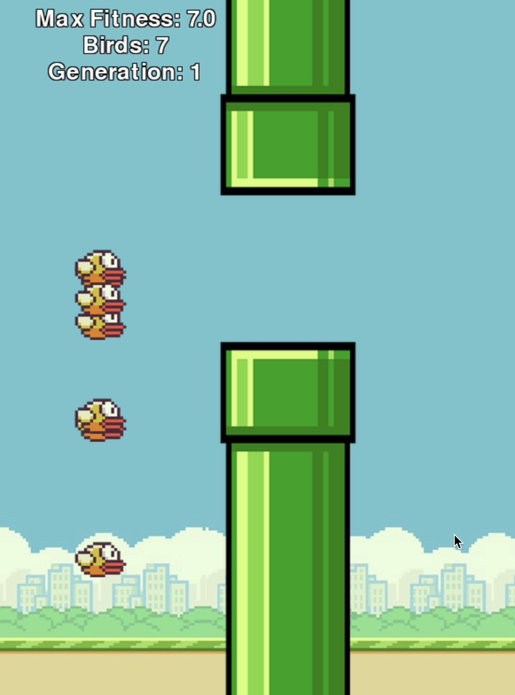

# Flappy Bird AI with NEAT

This is a Python-based clone of the classic **Flappy Bird** game, enhanced with an AI agent trained using the **NEAT (NeuroEvolution of Augmenting Topologies)** algorithm. The AI learns to play the game by evolving its neural network through generations, without any pre-labeled data or supervised training.

---

## Features

- 🎮 Flappy Bird mechanics using `pygame`
- 🧬 NEAT algorithm for AI evolution (`neat-python`)
- 🧠 AI learns to play by trial and error (reward / punishment)
- 🌆 Procedurally generated pipes with randomized locations
- 📈 Real-time score tracking and generation updates
- 🔁 Restart and replay options with keyboard input

---

## 📸 Game Layout



---

## 🚀 Getting Started

### ✅ Requirements

- Python 3.7+
- `pygame` 2.6.1
- `neat-python` 0.92

### 📦 Installation

1. Clone the repository:
   ```bash
   git clone https://github.com/christianbohl/Flappy-Bird-NEAT.git
